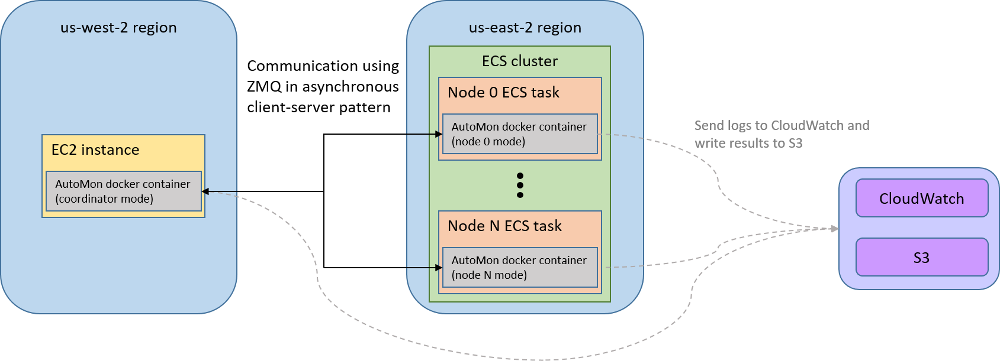

# AutoMon

AutoMon library for distributed function monitoring.

AutoMon is an easy-to-use algorithmic building block for automatically approximating arbitrary real
multivariate functions over distributed data streams.
Given a source code snippet of an arbitrary function of the global aggregate, AutoMon automatically
provides communication-efficient distributed monitoring of the function approximation,
without requiring any manual analysis by the user.
For more information regarding AutoMon see [AutoMon: Automatic Distributed Monitoring for Arbitrary
Multivariate Functions](TODO: add link)

## Installation

AutoMon is written in pure Python. Use the following instructions to install a
binary package with `pip`, or to download AutoMon's source code.
We support installing `automon` package on Linux (Ubuntu 18.04 or later) and
Windows (10 or later) platforms. Since [JAX](https://github.com/google/jax) is not fully supported on Windows, we use
[Autograd](https://github.com/HIPS/autograd) as the default automatic differentiation tool when running on Windows, and
JAX when running on Linux. 

To download AutoMon's source code run:
```bash
git clone https://github.com/<user_name>/automon
```
Let `automon_root` be the root folder of the project on your local computer, for example `/home/username/automon`.

To install AutoMon run (will work after the project is public):
```bash
pip install git+https://github.com/<user_name>/automon
```
The above installation will work after the project is public.
In the meantime, download the code and then use:
```bash
pip install <automon_root>
```

## Features

### Automatic differentiation tool
We support two automatic differentiation tools: [JAX](https://github.com/google/jax) and [Autograd](https://github.com/HIPS/autograd).
We use JAX as the default tool, and in case it is not installed (e.g. on Windows), we use Autograd.
It is possible to force using Autograd by adding at the beginning of the experiment:
```python
import os
os.environ['AUTO_GRAD_TOOL'] = 'AutoGrad'
```

### Lazy sync
We support two lazy sync techniques: least recently used (LRU) and random.
You can set the technique by calling `automon.test_utils.get_config()` with the required `sync_type` value.

### AutoMon, GM, CB, and RLV
The implementation in this project separates between the code of the basic Geometric Monitoring protocol and the code of 
a specific monitoring technique that adopts this protocol (such as AutoMon, GM, and CB).
The Geometric Monitoring protocol code is implemented in `automon/coordinator_common.py` and `automon/node_common.py`.
The code of a specific monitoring technique is in a subpackage named after the technique.
For example, AutoMon in under automon/automon.
This design enables developers to easily add new monitoring techniques, add features to existing techniques, or to
enrich the basic protocol.
For CB technique we provide the implementation of cosine similarity and inner product monitoring, based on
[Lazerson et al., 2016](https://dl.acm.org/doi/pdf/10.1145/3226113).
For GM technique we provide the implementation of entropy monitoring, based on
[Gabel et al., 2017](https://dl.acm.org/doi/pdf/10.1145/3097983.3098092), and of variance monitoring,
based on [Gabel et al., 2014](https://ieeexplore.ieee.org/stamp/stamp.jsp?tp=&arnumber=6877240).

## Usage example

### Distributed experiment

Initiate and run the coordinator on a designated server.
You could change the listening port of the coordinator.
```python
import automon as am
from automon.automon.coordinator_automon import CoordinatorAutoMon
from automon.automon.nodes_automon import NodeInnerProductAutoMon

coordinator_port = 64000
data_folder = "../datasets/inner_product/"

test_folder = am.test_utils.start_test("inner_product_coordinator")
conf = am.test_utils.read_config_file(data_folder)
coordinator = am.test_utils.get_coordinator(CoordinatorAutoMon, NodeInnerProductAutoMon, conf)
am.test_utils.run_coordinator(coordinator, coordinator_port, conf["num_nodes"], test_folder)
am.test_utils.end_test()
```

Initiate and run a node. The node can run on any computer or device with internet access.
Make sure the `coordinator_ip` and `coordinator_port` are set to the IP and port of the coordinator.
```python
import automon as am
from automon.automon.nodes_automon import NodeInnerProductAutoMon

coordinator_ip = '192.68.36.202'  # Replace this with the IP of the server that runs the coordinator
coordinator_port = 64000
node_idx = 0
data_folder = "../datasets/inner_product/"

test_folder = am.test_utils.start_test("inner_product_node")
conf = am.test_utils.read_config_file(data_folder)
data_generator = am.data_generator.DataGeneratorInnerProduct(num_iterations=conf["num_iterations"], num_nodes=conf["num_nodes"], data_file_name=data_folder+"data_file.txt", d=conf["d"])
node = am.object_factory.get_node(NodeInnerProductAutoMon, conf["domain"], conf["d"], node_idx)
am.test_utils.run_node(coordinator_ip, coordinator_port, node, node_idx, data_generator, conf["num_nodes"], conf["sliding_window_size"], test_folder)
am.test_utils.end_test()
```
Initiate all 9 other nodes similarly.
Don't forget to update the node_idx for every new instance.
After all the nodes and the coordinator are initiated the experiment begins automatically.

### Monitoring simulation
```python
import automon as am
from automon.automon.coordinator_automon import CoordinatorAutoMon
from automon.automon.nodes_automon import NodeInnerProductAutoMon

test_folder = am.test_utils.start_test("inner_product_simulation")
conf = am.test_utils.get_config(num_nodes=10, num_iterations=1020, sliding_window_size=20, d=40, error_bound=0.3)
data_generator = am.data_generator.DataGeneratorInnerProduct(num_iterations=conf["num_iterations"], num_nodes=conf["num_nodes"], d=conf["d"], test_folder=test_folder)
coordinator, nodes = am.object_factory.get_objects(NodeInnerProductAutoMon, CoordinatorAutoMon, conf)
am.test_utils.run_test(data_generator, coordinator, nodes, test_folder, conf["sliding_window_size"])
am.test_utils.end_test()
```

Find more examples under `<automon_root>/examples` folder.

To add a new function to monitor, follow these steps:
1. Add your function implementation to `<automon_root>/automon/functions_to_monitor.py`
3. Add a new AutoMon node class with the new function to `<automon_root>/automon/automon/nodes_automon.py`
2. Add your DataGenerator (which generates data or read from file) to `<automon_root>/automon/data_generator.py`

### Run as a docker container
We provide Dockerfile to support building the project as a docker image.
To build the docker image you must first install docker engine and docker cli.
After installing these, run the command to build the docker image:
```
sudo docker build -t automon <automon_root>
```
To run the docker container in a coordinator mode:
```
sudo docker run -p 6400:6400 --env NODE_IDX=-1 --env NODE_TYPE=inner_product --env ERROR_BOUND=0.3 --env S3_WRITE=1 -it --rm automon
```
and in a node 0 mode:
```
sudo docker run --env HOST=192.68.36.202 --env NODE_IDX=0 --env NODE_TYPE=inner_product --env ERROR_BOUND=0.3 --env S3_WRITE=1 --env --LS_LATENCY=1.0 -it --rm automon
```
If setting the container environment variable `S3_WRITE` to `1`, the results are written to AWS S3 bucket named `automon-experiment-results`.
Otherwise, it is advisable to run the container with `-v /home/ubuntu/test_results:<automon_root>/test_results`, so the results are written to the computer filesystem.

## Reproduce experimental results

Before running the experiments, download AutoMon's source code and then download the external datasets:
1. [Air Quality](https://archive.ics.uci.edu/ml/datasets/Beijing+Multi-Site+Air-Quality+Data):
download `PRSA2017_Data_20130301-20170228.zip` from [here](https://archive.ics.uci.edu/ml/machine-learning-databases/00501/) and unzip it.
Put the 12 `PRSA_Data_XXX_20130301-20170228.csv` files in `<automon_root>/datasets/air_quality` folder.
2. [Intrusion Detection](http://kdd.ics.uci.edu/databases/kddcup99/kddcup99.html):
download `kddcup.data_10_percent.gz` and `corrected.gz` from [here](http://kdd.ics.uci.edu/databases/kddcup99/kddcup99.html) and decompress.
Put the decompressed `kddcup.data_10_percent` and `corrected` files in `<automon_root>/datasets/intrusion_detection` folder.

Run all the experiments from within the tests folder:
```bash
export PYTHONPATH=$PYTHONPATH:<automon_root>
cd <automon_root>/tests
```

#### Error-Communication Tradeoff (Sec. 4.3)
To reproduce _Error-Communication Tradeoff_ results run:
```bash
python test_max_error_vs_communication_inner_product.py
python test_max_error_vs_communication_quadratic.py
python test_max_error_vs_communication_kld_air_quality.py
python test_max_error_vs_communication_dnn_intrusion detection.py
```
You will find the output files and figures in `<automon_root>/tests/test_results/results_test_max_error_vs_communication_inner_product_xxx` folders.

#### Scalability: Dimensions, Nodes, Runtime (Sec. 4.4)
To reproduce _Scalability to Dimensionality_ results run:
```bash
python test_dimension_impact_inner_product.py
python test_dimension_impact_kld_air_quality.py
python test_dimension_impact_mlp.py
```
These generate the output folders `<automon_root>/tests/test_results/results_test_dimension_impact_xxx`.
Open the script `<automon_root>/tests/visualization/plot_dimensions_stats.py` and update the name of the three output folders
at the bottom of the file and run the script.
The script generates four figures:
1. dimension_communication.pdf shows the total number of messages in each run for different functions and input dimensions.
2. dimension_coordinator_runtime.pdf shows the average time for the full sync of an AutoMon coordinator.
3. dimension_node_runtime.pdf shows the average time a node takes to check a single data update for each dimension.
4. dimension_node_runtime_in_parts.pdf shows the average time it takes the node to complete different tasks during the data update process.

To reproduce _Scalability to Number of Nodes_ results run:
```bash
python test_num_nodes_impact_inner_product.py
python test_num_nodes_impact_mlp_40.py
```
These generate the output folders `<automon_root>/tests/test_results/results_test_num_nodes_impact_xxx`.
Open the script `<automon_root>/tests/visualization/plot_num_nodes_impact.py` and update the name of the two output folders
at the bottom of the file and run the script.
The script generates the figure num_nodes_vs_communication.pdf that illustrates how the number of messages grows with
the number of AutoMon nodes.

#### Impact of Neighborhood Size Tuning (Sec. 4.5)
To reproduce _Neighborhood Size Tuning_ results run:
```bash
python test_optimal_and_tuned_neighborhood_rozenbrock.py
python test_optimal_and_tuned_neighborhood_mlp_2.py
```
These generate the output folders `<automon_root>/tests/test_results/results_optimal_and_tuned_neighborhood_xxx` where you will find the
figure neighborhood_size_error_bound_connection_avg.pdf and other output files.

Open the scripts `<automon_root>/tests/test_neighborhood_impact_on_communication_rozenbrock.py` and `<automon_root>/tests/test_neighborhood_impact_on_communication_mlp_2.py`
and update at the bottom of the files the output folders `results_optimal_and_tuned_neighborhood_xxx` respectively. Run:
```bash
python test_neighborhood_impact_on_communication_rozenbrock.py
python test_neighborhood_impact_on_communication_mlp_2.py
```
You will find the output files and figures in `<automon_root>/tests/test_results/results_comm_neighborhood_xxx` folders.

#### Impact of ADCD, Slack, and Lazy Sync (Sec. 4.6)
To reproduce the _Ablation Study_ results run:
```bash
python test_ablation_study_mlp_2.py
python test_ablation_study_quadratic_inverse.py
```
You will find the output files and figures in `<automon_root>/tests/test_results/results_ablation_study_xxx` folders.


## Distributed experiment on a real-world WAN
We verified our simulation through a series of cross-region experiments on AWS.
We conducted each run in our experiments on two clusters:
one cluster is located in US-West (Oregon) region and is comprised of a single coordinator using 16 virtual CPUs and 32GB of memory;
the other one is located in US-East (Ohio) region and includes all the node tasks, each of them with 1 virtual CPU and 4GB of memory.

To run such a distributed experiments you will need an AWS account, docker engine, docker cli, and aws cli.
After having these tools installed and configured follow these steps:
1. Download AutoMon's source code and the external datasets.
2. Create AWS IAM user with  AdministratorAccess permissions and download the csv file `new_user_credentials.csv` that contains the key ID and the secret key.
3. Place the `new_user_credentials.csv` file in `<automon_root>/examples/aws_utils` folder.
4. Build AutoMon's docker image, push it to AWS ECR, and start the experiment:
```bash
sudo docker build -t automon .
aws ecr get-login-password --region us-east-2 | sudo docker login --username AWS --password-stdin <your_AWS_account_number>.dkr.ecr.us-east-2.amazonaws.com/automon
sudo docker tag automon <your_AWS_account_number>.dkr.ecr.us-east-2.amazonaws.com/automon
sudo docker push <your_AWS_account_number>.dkr.ecr.us-east-2.amazonaws.com/automon
python <automon_root>/examples/aws_utils/start_aws_task.py
```
You can follow the status of the tasks in ECS console and watch the logs in CloudWatch console.
After the experiment finishes the results are written to S3 bucket named `automon-experiment-results`.

There are two different options to run the experiment.
The first option is to run the coordinator and nodes as ECS Fargate tasks.
The following figure demonstrates the system structure:


ECS Fargate task is limited to 4 vCPU and 16GB of memory on an Intel Xeon CPU at 2.2–2.5 GHz.
Therefore, this option is suitable for cases that do not require strong coordinator (e.g., inner product monitoring). 
The second option is to run the coordinator on an EC2 instance:



We use EC2 c5.4xlarge instance (16 vCPU and 32GB of memory on an Intel Xeon CPU at 3.4–3.9 GHz).
This option is suitable for cases that require heavy computations (e.g. DNN monitoring).


## Citing AutoMon

If `automon` has been useful for your research and you would like to cite it in an academic
publication, please use the following Bibtex entry:
```bibtex
@article{automon,
  author  = {Anonymous Authors},
  title   = {AutoMon: Automatic Distributed Monitoring for Arbitrary Multivariate Functions},
  journal = {TODO},
  year    = {TODO},
  volume  = {TODO},
  number  = {TODO},
  pages   = {TODO-TODO},
  url     = {TODO}
}