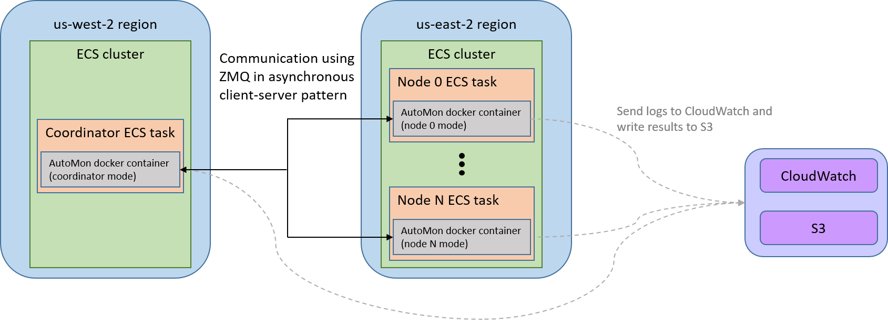
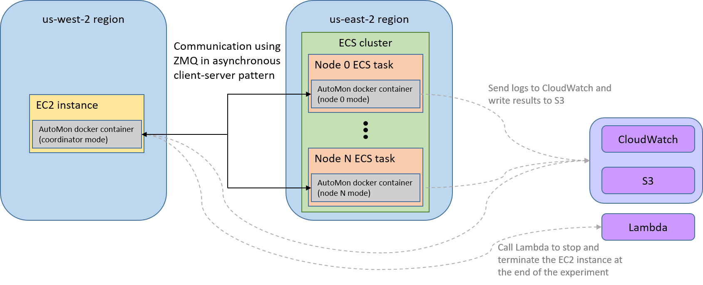

# Distributed experiment on a real-world WAN
We include code for a series of cross-region experiments on AWS using two clusters:
one cluster is located in US-West (Oregon) region and is comprised of a single coordinator using 16 virtual CPUs and 32GB of memory;
the other one is located in US-East (Ohio) region and includes all the node tasks, each of them with 1 virtual CPU and 4GB of memory.

Note: Running the AWS experiments would cost several hundred dollars!
The user must monitor his ECS tasks and EC2 instances, and manually shutdown any dangling tasks/instances in case of failures
to avoid unnecessary charges.

## Reproduce experiments using a single script
We provide a single script that runs all the experiments and generates the papers figures.
The script can be run as a standalone, and in that case it also downloads the project source code,
or it can be run as part of a cloned project.
It first runs all the simulation experiments (see [here](../experiments/README.md)), and then all the distributed
experiments on AWS.

To run the script as a standalone, download only the file [`reproduce_experiments.py`](../reproduce_experiments.py)
and run it, using the `--aws` flag: `python reproduce_experiments.py --aws`.
To run the script from within a cloned project, first clone the project,
`git clone https://github.com/hsivan/automon`,
and then run the script: `python <automon_root>/reproduce_experiments.py --aws`.

## Reproduce experiments manually

To run these distributed experiments you will need an AWS account, docker engine, docker cli, and aws cli.
After having these tools installed and configured follow these steps:
1. Download AutoMon's source code and the external datasets (see [download instructions](../experiments/README.md)). Set `PYTHONPATH`: `export PYTHONPATH=$PYTHONPATH:<automon_root>`
2. Create AWS IAM user with  AdministratorAccess permissions and download the csv file `new_user_credentials.csv` that contains the key ID and the secret key.
3. Place the `new_user_credentials.csv` file in `<automon_root>/aws_experiments` folder.
4. Build AutoMon's docker image and push it to AWS ECR:
```bash
sudo docker build -f aws_experiments/awstest.Dockerfile  -t automon .
aws ecr describe-repositories --repository-names automon || aws ecr create-repository --repository-name automon
aws ecr get-login-password --region us-east-2 | sudo docker login --username AWS --password-stdin <your_AWS_account_number>.dkr.ecr.us-east-2.amazonaws.com/automon
sudo docker tag automon <your_AWS_account_number>.dkr.ecr.us-east-2.amazonaws.com/automon
sudo docker push <your_AWS_account_number>.dkr.ecr.us-east-2.amazonaws.com/automon
```

You can now start the experiments:
```bash
python <automon_root>/aws_experiments/deploy_aws_experiment.py --node_type inner_product --block
python <automon_root>/aws_experiments/deploy_aws_experiment.py --node_type quadratic --block
python <automon_root>/aws_experiments/deploy_aws_experiment.py --node_type kld --block
python <automon_root>/aws_experiments/deploy_aws_experiment.py --node_type dnn --block
```

You can follow the status of the tasks in ECS console and watch the logs in CloudWatch console.
After the experiment finishes the results are written to S3 bucket named `automon-experiment-results`.

There are two different options to run the experiment.
The first option is to run the coordinator and nodes as ECS Fargate tasks.
The following figure demonstrates the system structure:



ECS Fargate task is limited to 4 vCPU and 16GB of memory on an Intel Xeon CPU at 2.2–2.5 GHz.
Therefore, this option is suitable for cases that do not require strong coordinator (e.g., inner product monitoring). 
The second option is to run the coordinator on an EC2 instance:



We use EC2 c5.4xlarge instance (16 vCPU and 32GB of memory on an Intel Xeon CPU at 3.4–3.9 GHz).
This option is suitable for cases that require heavy computations (e.g. DNN monitoring).

To switch between these options use `--coordinator_aws_instance_type <type>` when running the experiment, where `<type>`
is either `ec2` (the default type) or `fargate`.
